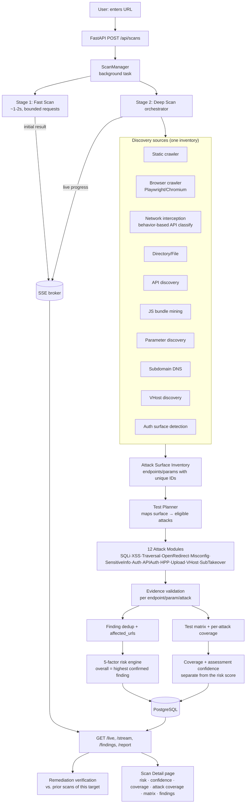

# Architecture

**Perry** — a web application security scanner with two independent entry
points that do not share a risk model:

1. **Web pipeline** — a user registers a target, verifies ownership, and
   enters a URL. A fast preliminary result comes back in ~1-2s, then a
   purely deterministic deep assessment runs in the background: one
   centralized crawler feeds one Attack Surface Inventory, a Test Planner
   maps it to the 12 in-scope attacks, and a **5-factor risk score**
   (`app/services/risk_engine.py`) is computed — no AI/LLM layer, no
   source-code analysis. Results stream live over SSE.
2. **CLI / CI-CD pipeline** (`app/cli.py`) — a static, local, non-network
   scan of a source checkout: secrets, AST-based SAST (Python, JS/TS
   natively; Java/Go/PHP/Ruby/Rust/C# via `tree-sitter`, see
   `app/services/polyglot_sast.py`), and dependency advisories across 8
   ecosystems, gated on severity/risk thresholds for build pipelines. No
   target ownership verification applies here — the developer already has
   the checkout. See [CLI / CI-CD Mode](#cli--cicd-mode).

Both entry points score findings with the same per-finding **5-factor
formula** (`risk_engine.score_finding`/`risk_breakdown`) via
`FindingCandidate` → `severity_policy.apply_policy` → `risk_engine.score_all`
— but the web pipeline's *overall* risk (highest confirmed finding) and the
CLI's *overall* risk are computed independently for their respective finding
sets; a CI run and a dashboard scan are two different attack surfaces
(source code vs. a running target), not the same number.

## High-level flow (dynamic web pipeline)

The dynamic web pipeline is purely deterministic — no AI/LLM layer, no
source-code analysis (that's the separate CLI, above). One centralized crawler feeds
one Attack Surface Inventory; a Test Planner maps it to the 12 in-scope
attacks; the attack modules run; risk is the deterministic 5-factor formula.



## Backend (FastAPI + async SQLAlchemy + Postgres)

```
app/
├── cli.py                CI/CD entrypoint: `python -m app.cli scan <path>`
│                         (see CLI / CI-CD Mode below) — no FastAPI needed
├── api/
│   ├── auth.py           signup/login (JWT), /auth/me
│   ├── targets.py        register a target, issue/verify ownership challenge
│   ├── scans.py          REST + SSE: create, /live, /stream, findings,
│   │                     endpoints, subdomains, source-findings,
│   │                     repositories, events, report, cancel
│   └── dashboard.py      summary stats (scoped to the caller)
├── services/
│   ├── scan_manager.py   owns lifecycle; launches background task; persists;
│   │                     publishes progress to the SSE broker
│   ├── scan_broker.py    in-process pub/sub (asyncio queues) for SSE
│   ├── target_verification.py  DNS TXT / .well-known file / meta-tag
│   │                     ownership challenges; gates active testing
│   ├── http_client.py    Fetcher: pooled AsyncClient, bounded concurrency,
│   │                     request budget, size caps, dedup, manual redirects,
│   │                     body (json/form) + header support, one bounded
│   │                     retry on transient network errors
│   ├── scope.py / scope_policy.py   URL validation + in-scope predicate
│   ├── fast_scanner.py   Stage 1: concurrent lightweight checks
│   ├── deep_scan.py      Stage 2 orchestrator (concurrent stages) +
│   │                     finding dedup + test-matrix builder + repo-analysis
│   │                     wiring (`_convert_repo_findings`, `correlate`) +
│   │                     `_assess_subdomains` (bounded, budget-shared
│   │                     independent assessment of resolved subdomains)
│   ├── crawler.py        bounded BFS crawl; links/forms/params/uploads
│   │                     (preserves the file-input field name + enctype)
│   ├── directory_scanner.py   wordlist dir/file + sensitive-file checks;
│   │                     redirects not followed for sensitive-file probes;
│   │                     dispatches traversal-on-path for file-shaped hits
│   ├── api_discovery.py  OpenAPI/Swagger + common API paths
│   ├── parameter_discovery.py normalized param dedup
│   ├── subdomain_scanner.py   DNS enumeration, guarded by the same
│   │                     wildcard-DNS check as vhost_scanner
│   ├── vhost_scanner.py  Host-header VHost discovery + isolation assessment;
│   │                     owns the shared `_wildcard_dns()` guard
│   ├── active_engine.py  UNIFIED active testing: ParamTarget → PayloadStrategy
│   │                     → RequestBuilder → ResponseDiff → Finding
│   │                     (XSS, SQLi, traversal, command-injection, HPP,
│   │                      open redirect; adaptive prioritization). Runs
│   │                     over crawler params, API-discovered params, and
│   │                     each assessed subdomain's params. Path-traversal/
│   │                     command-injection escalate to a few encoded
│   │                     variants (`encode_variants`, `unicode_slash_variants`)
│   │                     only after the plain payload came back negative.
│   ├── custom_tests.py   executes user-defined `CustomTestCase` entries
│   │                     through the same ParamTarget/RequestBuilder/
│   │                     ResponseDiff pipeline as active_engine — no
│   │                     separate HTTP handling or scoring
│   ├── security_checks.py     passive checks (headers, cookies, CORS,
│   │                     version, dir-listing, debug traces, sensitive files,
│   │                     API security); redirects not followed for API/
│   │                     sensitive-file probes. Also: `check_upload_endpoint`
│   │                     (safe canary-file upload verification),
│   │                     `check_path_traversal_on_path` (traversal against a
│   │                     discovered resource's own path segment, reusing the
│   │                     same payload/detection as the parameter-based
│   │                     check), `check_authz_boundary` (differential
│   │                     authenticated-vs-unauthenticated diff using a
│   │                     dev-supplied credential)
│   ├── security_test_cases.py declarative test-case registry — unused by
│   │                     the real pipeline (active_engine.py is the actual
│   │                     engine); kept only for the historical `SecurityTestCase`
│   │                     shape, not extended
│   ├── response_analyzer.py   fingerprint + soft-404/SPA profiling +
│   │                     similarity + blocked-response (`INCONCLUSIVE`)
│   │                     detection for blanket-WAF/auth-gate responses
│   ├── repo_discovery.py      finds a public GitHub/GitLab repo for a target
│   ├── repo_analyzer.py       clones (blobless sparse clone) or reads a local
│   │                     checkout; secret scan (git-tracking aware — a
│   │                     gitignored/never-committed secret is reported
│   │                     informationally, not as a vulnerability), AST SAST,
│   │                     dependency/OSV scan with strict version-range
│   │                     validation and reachability
│   ├── repo_correlator.py     matches a source-code finding to a live
│   │                     endpoint by route-segment/filename token match;
│   │                     never invents confidence beyond the source
│   │                     finding's own, and dedups onto that finding's key
│   ├── sast_engine.py    AST-based taint analysis (source → sink, sanitizers)
│   ├── dependency_analysis.py  declared-dependency parsing, direct/dev/used
│   │                     classification
│   ├── reachability.py   is the advisory's named symbol actually reachable
│   │                     from attacker-controlled input?
│   ├── js_analyzer.py    bundled-JS route/secret extraction, live-probed
│   │                     before being treated as confirmed
│   ├── secret_redactor.py     redaction helpers shared by repo + summary paths
│   ├── version_ranges.py      semver range parsing/matching for advisories
│   ├── severity_policy.py     evidence-based severity/confidence
│   │                     normalization — a static pattern match on an
│   │                     attack-claim category (code_security,
│   │                     dependency_vulnerability, input_validation,
│   │                     authentication) is capped until demonstrated by
│   │                     an observed request/response pair
│   ├── risk_engine.py    deterministic scoring helpers (ordering only)
│   ├── risk_model/       Perry Risk Model v1 (see below)
│   ├── security_graph.py      attack-surface graph used by risk aggregation
│   ├── scan_summary.py   aggregates everything into ONE structured payload
│   ├── llm_security_analyst.py  Groq: one call, strict prompt, 1 retry,
│   │                     Pydantic SecurityAssessment (risk_score/level/
│   │                     summary/risk_factors/recommendation)
│   ├── report_generator.py    JSON report (+ frontend builds the PDF);
│   │                     classifies each finding OPEN/REGRESSED/UNVERIFIED
│   │                     against the target's last two completed scans by
│   │                     a stable per-finding fingerprint, and reports a
│   │                     fixed-since-last-scan count — never touches code
│   ├── finding_types.py  FindingCandidate + severity ranks
│   ├── discovery_types.py     crawl/discovery dataclasses
│   └── wordlists.py      small embedded wordlists
├── models/               SQLAlchemy: User, Target, VerifiedTarget, AuditLog,
│                         Scan, ScanEvent, DiscoveredEndpoint, Parameter,
│                         Subdomain, Finding, Report, Repository,
│                         SourceFinding — see README's Database Schema
├── config.py             env-driven settings (DB, JWT, Groq, repo-clone,
│                         per-stage safety limits)
└── database.py           async engine/session
alembic/                  migrations (12, linear — see README)
```

## Attack Surface Inventory + Test Planner + attack modules

Three modules make discovery and testing separable and honest:

- **`inventory.py`** — the one `AttackSurfaceInventory` every discovery source
  populates. Each endpoint/parameter gets a unique id (`ep_0001`/`pm_0001`)
  and a `normalized_route` (id-shaped path segments collapsed to `{id}`), so
  the same route/param seen twice counts once and path parameters are
  identifiable. No attack module discovers on its own.
- **`test_planner.py`** — `plan_tests(inventory, …)` maps the inventory to the
  12 attacks by eligibility (SQLi/XSS → injectable params; traversal →
  file-shaped params; open redirect → redirect params/3xx endpoints; upload →
  multipart endpoints; API-auth → API endpoints; auth → auth surface;
  misconfig/sensitive-info/vhost → host-level; subdomain-takeover →
  subdomains). Pure and deterministic; it selects targets, never sends a
  request. Eligible-but-not-run tests stay visible as `NOT_TESTED`.
- **`attacks/`** — `catalog.py` (the 12 canonical names), `executor.py`
  (`execute_plan` → one `TestExecution` per planned test, plus a
  `FindingCandidate` when the evidence proves a vulnerability), and
  `modules.py` (the 12 runners, each wrapping evidence-based detection from
  `active_engine`/`security_checks`, plus `subdomain_takeover.py`). The
  registry is keyed by the 12 names so a 13th is a local addition, never a
  crawler change.

## Risk model — deterministic 5-factor (`app/services/risk_engine.py`)

The one risk calculation. Pure and deterministic — the same findings always
produce the same score, with no AI and no CVSS/aggregation machinery:

```
Risk = 0.35·TypeSeverity + 0.20·Confidence + 0.20·Exposure
     + 0.15·BlastRadius + 0.10·AssetSeverity          (each factor 0-100)
```

- **TypeSeverity** — the finding's severity band (critical…info).
- **Confidence** — `confirmed`/`potential`/`uncertain`/`false_positive`
  (unknown → `uncertain`, never a mid-value default).
- **Exposure** — how many locations the issue affects (`exposure_multiplier`
  tiers, hard-capped).
- **BlastRadius** — how far exploitation could spread, per category.
- **AssetSeverity** — how sensitive the tested endpoint/parameter is.

**Overall application risk = the highest confirmed/validated finding's own
5-factor score** (`overall_confirmed_risk`) — not an aggregation of many
findings, and never modified by coverage. Findings are deduplicated by
`dedup_key` (`risk_model.deduplicate`) before scoring. A scan with no
confirmed findings is 0.

## Coverage & Assessment (`app/services/coverage.py`, `app/services/assessment.py`)

A risk score is only as trustworthy as how much of the target was actually
examined. Perry reports three separate numbers so low coverage never
masquerades as low risk:

- **`overall_risk`** (0-100) — how bad the worst *confirmed* evidence is.
- **`assessment_confidence`** (`HIGH`/`MEDIUM`/`LOW`/`INSUFFICIENT`) — how
  much to trust that score, given how much was examined.
- **`assessment_coverage`** (0-100%) — the raw discovery+testing completeness.

**Coverage never modifies the risk score.** `overall_risk` is exactly
`overall_confirmed_risk(findings)` (the highest confirmed finding's 5-factor
score); coverage and confidence are reported next to it, not folded in. This
is the key property: a barely-examined target can't read as "safe" (its
*confidence* is low), and a shallow-but-clean scan can't inflate its risk.

- **Per-attack coverage** (`coverage.per_attack_coverage`): for each of the
  12 attacks — eligible / tested / skipped / inconclusive / vulnerable /
  not-vulnerable, plus a rolled-up status. Discovery is never counted as
  testing (§27): eligible ≠ tested.
- **Test matrix** (`coverage.build_test_matrix`): one row per executed test
  (endpoint, normalized route, parameter, attack, status) — proof an attack
  actually ran.
- **Crawl coverage** (`CoverageMetrics`): discovered-vs-tested counts for
  URLs/APIs/params/forms/etc. Its `coverage_ratio` blends test-completeness
  (65%) and discovery-breadth (35%) and feeds only the confidence ladder.

`assessment_confidence` is a deterministic threshold ladder on
`coverage_ratio` + the inconclusive-test ratio + scan-error/crawl-limit
flags (`_confidence` in `assessment.py`) — never inferred from the risk score
itself. Below `HIGH`, a `warning` string explains why.

### Test-status vocabulary (`app/services/test_status.py`)

Every matrix row and per-attack summary reports one of five statuses, not a
pass/fail binary:

| Status | Meaning |
|---|---|
| `VULNERABLE` | The test ran against real discovered surface and found an issue. |
| `NOT_VULNERABLE` | The test ran against real discovered surface and found nothing. |
| `NOT_TESTED` | The attack surface was never discovered, or the test didn't run (budget/authorization/scope) — never a claim of safety. |
| `INCONCLUSIVE` | The test ran but produced ambiguous evidence (e.g. no credential to probe an authorization boundary that does exist). |
| `NOT_APPLICABLE` | This test class genuinely doesn't apply (e.g. no authentication system exists on the target at all). |

The distinction that matters most: **zero discovered attack surface is
`NOT_TESTED`, never a silent `NOT_VULNERABLE`.** This is the direct fix for
a target reporting a misleadingly clean "API Security: PASS" purely because
zero API endpoints were ever discovered against it.

## Real-browser crawling (`app/services/browser_crawler.py`)

A static BeautifulSoup parse of the homepage response sees nothing an
Angular/React/Vue SPA injects into the DOM after JS execution, and never
sees a request the app's own client-side code issues (`fetch`/XHR/axios/
Angular `HttpClient` all funnel through the same browser network layer, so
none need special-casing). `browser_crawl` drives one headless-Chromium
instance per deep scan via Playwright, navigating same-origin links found in
the *rendered* DOM (not the raw HTML) and capturing every network request
via `page.on("request"/"response")`.

**Classification is behavior-based, never a URL-string match**
(`network_classifier.py`): Playwright's own `resource_type` (`"xhr"`/
`"fetch"` = the app issued this as data, not a page load) plus the
response's actual content-type decide API vs. page vs. asset vs. GraphQL vs.
WebSocket — a request to `/rest/products` or `/whatever-shape-the-backend-
uses` is classified identically to one at `/api/products`, which is exactly
the fix for a scanner that only ever finds endpoints shaped like its own
wordlist.

Graceful degradation: if Playwright/Chromium isn't installed,
`browser_crawl` returns an empty result with `.errors` populated instead of
raising, and `deep_scan.py` falls back to the static crawler alone — this is
never a hard runtime dependency.

## Auth & Target Verification

Accounts (`User`) have a **role** that decides which half of the product
they see: `developer` runs full authorized scans against their own
infrastructure; `customer` only gets a passive URL safety check. JWT auth
(`app/services/auth.py`, 7-day expiry by default); the frontend never holds
long-lived credentials.

Before **active testing** (crafted/attacking payloads) may run against a
`Target`, the caller must complete one ownership-verification challenge
(`app/services/target_verification.py`), issued by `POST /api/targets` and
checked by `POST /api/targets/{id}/verify`:

- **DNS** — a TXT record at `_Perry.<hostname>` containing the issued token.
- **HTTP file** — `/.well-known/Perry-verification.txt` on the host.
- **Meta tag** — `<meta name="Perry-verification" content="...">` in `<head>`.

Verification is TTL-limited (90 days) and tracked as
`UNVERIFIED → VERIFICATION_PENDING → VERIFIED` (or `VERIFICATION_FAILED` /
`EXPIRED`). Until `VERIFIED`, scans against that host run **passive-only**
— no crafted payloads sent. `localhost`/loopback/private-IP targets are
exempt (there's no one else to ask permission from). Security-sensitive
actions are appended to `AuditLog`; verification tokens and scan payloads
are deliberately never written there.

Once `VERIFIED`, the owning developer may additionally set a test
credential (`POST /api/targets/{id}/credential` → `VerifiedTarget.auth_header`)
— a raw header value for one identity they control, used only for
differential authenticated-vs-unauthenticated checks against that host.
Never logged, never audited, never returned from any `GET`. `scan_manager.py`
looks it up at scan-run time only for a non-passive scan of a verified
target, and passes it into `run_deep_scan` — nowhere else touches it.

## New Testing Capabilities

Closing gaps where something was discovered/detected but never actually
tested — all integrated into the existing evidence → validation →
severity → risk → reporting pipeline, no parallel implementations:

```text
Discovery → API param wiring → File upload testing → Traversal (path +
resource) → Authentication/Authorization → Subdomain assessment →
Custom tests → Payload strategy (+ encoding) → Evidence/validation →
Severity/Risk → Reporting → Remediation verification → CI/CD gate
```

- **File upload testing** (`security_checks.check_upload_endpoint`) — safe
  canary-file uploads (never executable content) distinguish *detected* →
  *tested* → *weak validation* (disallowed extension/traversal-shaped
  filename accepted) → *verified* (Perry fetches back its own canary and
  confirms it's served). A bare detected endpoint never escalates on its own.
- **Traversal on discovered resources** (`check_path_traversal_on_path`,
  dispatched from `directory_scanner.py` for file-shaped hits) — reuses the
  exact `_TRAVERSAL_PAYLOAD`/passwd-detection regex from the
  parameter-based check, substituted into the resource's own path segment,
  with a baseline comparison so a page that always contains passwd-shaped
  text isn't misread as vulnerable.
- **API injection testing** (`deep_scan.py`) — API-discovered parameters
  now run through `active_engine.run_active_tests`, the same engine crawl
  params already used, once `discover_apis` resolves them.
- **Authentication/authorization** (`check_authz_boundary`) — see Auth &
  Target Verification above. Without a credential, the test matrix records
  this test as `inconclusive`, never guessed either way.
- **User-defined custom test cases** (`custom_tests.py`,
  `Scan.custom_test_cases_json`, `CustomTestCase` schema) — up to 20 per
  scan, executed through the same `ParamTarget`/`build_request`/response
  pipeline as every built-in test, scope-checked and severity-capped
  identically. Deliberately separate from `wordlists.py`.
- **Payload encoding** (`active_engine.py`) — `encode_variants` (already
  defined, previously never called) and a new `unicode_slash_variants` now
  escalate path-traversal/command-injection payloads, but only after the
  plain payload came back negative and only for query/form locations.
- **Independent subdomain assessment** (`deep_scan._assess_subdomains`) —
  up to `settings.SUBDOMAIN_ASSESS_LIMIT` reachable, in-scope subdomains get
  their own not-found baseline, passive checks, and a small API/active pass,
  sharing the scan's one request budget. A DNS record alone is never a
  finding — unreachable subdomains are skipped before any check runs.
- **Remediation verification** — see `report_generator.py` above.

## Recent robustness hardening

An audit of the scanning pipeline found several places where a single weak
signal could produce a false positive/negative or a miscalibrated severity.
Fixed, all as corrections to existing logic rather than new architecture:

- **Secret git-tracking awareness** — a secret in a file that is gitignored
  and never staged is reported as an informational hygiene note (zero risk
  contribution), not scored the same as a genuinely committed exposure.
- **Severity capping scoped correctly** — an unconfirmed finding (no
  observed request/response pair) is capped at Medium, but only for
  categories that make an *attack* claim (`code_security`,
  `dependency_vulnerability`, `input_validation`, `authentication`) — a
  secret match is its own evidence and is exempt, so a confirmed committed
  secret still scores Critical.
- **`repo_correlator` no longer manufactures confidence** — a route-segment
  match to a filename is one corroborating signal, not a demonstration; it
  now requires an exact token match (not a bare substring) and propagates
  the source finding's own confidence instead of hardcoding `confirmed`,
  and reuses that finding's `dedup_key` so it merges instead of scoring the
  same issue twice.
- **Blocked/WAF responses** — `response_analyzer` compares a 401/403
  against a captured baseline probe and returns `INCONCLUSIVE` (not
  `REAL`) when the block is a generic, blanket response, so a WAF or
  catch-all auth gate can't flood discovery with false hits.
- **Wildcard-DNS guard shared between `vhost_scanner` and
  `subdomain_scanner`** — a wildcard record makes every probed
  label/subdomain "resolve," carrying no information.
- **Redirects not silently followed** in sensitive-file/API discovery
  probes, so a 3xx to a login/error page is never misattributed to the
  originally probed path.
- **`http_client` bounded retry** — one retry on transient
  connect/timeout/refused errors before giving up, so a single dropped
  packet isn't read as "this path is safe."
- **`confidence_of` no longer defaults unknown values to a mid-score** — an
  unrecognized confidence string is treated as `uncertain` (the lowest
  non-zero tier) and logged, never silently scored between `uncertain` and
  `potential`.
- **Dependency-scan correctness** — malformed manifests log a warning
  instead of failing silently; a package pinned to different versions in
  `dependencies` vs `devDependencies` is queried for both instead of one
  being dropped by a dict-merge collision.

Regression tests for all of the above live in `backend/tests/`.

## CLI / CI-CD Mode (`app/cli.py`)

`python -m app.cli scan <path>` runs three independent analyzers over a
local checkout and merges their output into one `FindingCandidate` list,
scored by the same `risk_engine` 5-factor formula the web pipeline uses:

- **Secrets** (`repo_analyzer._scan_secrets`) — regex-based, genuinely
  language-agnostic: runs over every gathered file regardless of extension.
- **SAST** (`sast_engine.analyze_sources`) — dispatches by extension to
  either the native Python (`ast`)/JS-TS (`esprima`) taint visitors, or (for
  `.java`/`.go`/`.php`/`.rb`/`.rs`/`.cs`) `polyglot_sast.analyze_polyglot`.
- **Dependencies** (`repo_analyzer._scan_dependencies` +
  `dependency_analysis.py`) — manifest readers per ecosystem (npm, PyPI, Go
  modules, RubyGems, Maven, Packagist, crates.io, NuGet), each querying
  OSV.dev (`_query_osv`, ecosystem-agnostic — it's just a string in the
  request payload) then running the same reachability classification
  (`reachability.py`) regardless of ecosystem.

### `polyglot_sast.py` — one generic taint engine, not six

The native Python/JS engines are two independent, hand-rolled
`ast.NodeVisitor`/esprima-closure implementations with no shared
abstraction. Rather than write four more from-scratch parsers,
`polyglot_sast.py` implements **one** intraprocedural taint algorithm — the
same shape as `sast_engine._PyTaint` (track a `tainted: dict[name ->
provenance]`, propagate through assignment/concatenation, flag a tainted
value reaching a `Rule.sink`, downgrade through a `Rule.sanitizer`) — driven
by `tree-sitter` grammars and a small per-language table of verified node
type names (`_dotted()` flattens each language's call/member syntax into one
dotted-string form so `sast_engine._rule_for` and its sink table work
unmodified across all languages).

Two mechanics specific to real-world code, not just syntax:

- **Framework-aware source detection** (`_seed_params`) — real handlers
  bind input onto **parameters** via an annotation (Spring's
  `@RequestParam`, ASP.NET's `[FromQuery]`), a type hint (Laravel's
  `Request $request`), or a typed extractor (axum/actix's `Query<T>`), not a
  raw platform call. Without this, idiomatic Spring/ASP.NET/Laravel/axum
  code has literally no recognizable attacker-controlled input and reports
  a false "0 findings" indistinguishable from genuinely clean code.
  `_seed_params` runs whenever `_walk` enters a function/method declaration,
  seeding `tainted` from the parameter list before the body is walked. Go's
  case is a per-file *root* extension rather than a per-parameter value seed
  (`__extra_go_roots__` inside the `tainted` dict) — Go doesn't do
  annotation-based binding, so instead any parameter typed `*http.Request`
  becomes an additional recognized source root regardless of what it's
  named (generalizing the fixed `r`/`req`/`request` name-matching that
  already covers idiomatic handlers).
- **Receiver taint propagation** — `$request->input('x')` is tainted
  because `$request` itself is a known-tainted object (from `_seed_params`),
  not because an *argument* to `input()` is tainted. `_taint_of`'s call
  branch checks the call's own dotted root against `tainted` before falling
  back to checking arguments.

Coverage is never silent: `sast_engine.compute_language_coverage` reports,
per language, how many files were found vs. analyzed vs. skipped and why
(`"tree-sitter not installed"` is the only skip reason today) — surfaced in
the CLI's `languages` report section and JSON key, so a whole language never
being checked can't be mistaken for "verified clean."

## Frontend (React + TypeScript + Vite + Tailwind)

```
src/
├── App.tsx               routes: Dashboard, New Scan, Scan Detail
├── components/Layout.tsx top bar / nav
├── pages/
│   ├── NewScan.tsx       single URL input → POST /api/scans
│   ├── Dashboard.tsx     recent scans + Groq risk + severity chart
│   └── ScanDetail.tsx    live SSE view: risk hero, AI summary, risk factors,
│                         security-test matrix, findings, PDF export
├── services/api.ts       REST client + EventSource (SSE) stream
└── types/index.ts        shared types
```

The Groq API key lives only on the backend and is never sent to the frontend.

## Scan lifecycle

```
QUEUED → FAST_SCANNING → INITIAL_RESULT_READY → DEEP_SCANNING
       → AI_ANALYSIS → COMPLETED          (or FAILED / CANCELLED)
```

## Test target

`testsite/server.py` — a loopback-only, deliberately vulnerable app (fake
secrets) used for development and the integration tests. See `TESTING.md`.

## Performance principles

Optimise **time-to-first-result** (Fast Scan), then run the Deep Scan in the
background. Everywhere: `asyncio` + pooled `httpx.AsyncClient`, bounded
concurrency, per-scan request budget, response-size caps, request dedup, short
timeouts, and **baseline → high-value test → variants only if interesting**
(no brute-forcing every payload against every parameter). One Groq call per
scan — never per finding or per request.
```
