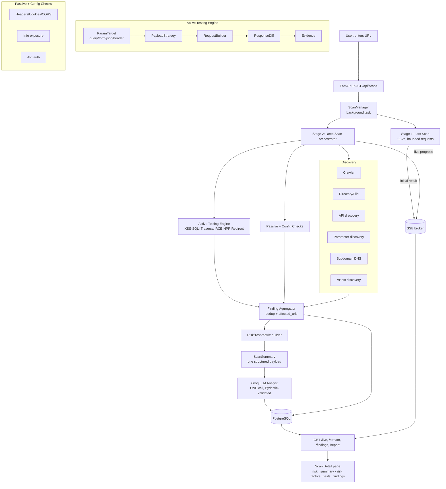

# Architecture

**Sentinel** — a web application security scanner. The user enters a URL and
gets a fast preliminary result, then a deep automated assessment analyzed by
an LLM. Two-stage async pipeline: **Fast Scan** (≈1–2s) → **Deep Scan** →
**one Groq call** → results on a single page.

## High-level flow



## Backend (FastAPI + async SQLAlchemy + Postgres)

```
app/
├── api/
│   ├── scans.py          REST + SSE: create, /live, /stream, findings,
│   │                     endpoints, subdomains, events, report, cancel
│   └── dashboard.py      summary stats
├── services/
│   ├── scan_manager.py   owns lifecycle; launches background task; persists;
│   │                     publishes progress to the SSE broker
│   ├── scan_broker.py    in-process pub/sub (asyncio queues) for SSE
│   ├── http_client.py    Fetcher: pooled AsyncClient, bounded concurrency,
│   │                     request budget, size caps, dedup, manual redirects,
│   │                     body (json/form) + header support
│   ├── scope.py          URL validation + in-scope predicate
│   ├── fast_scanner.py   Stage 1: concurrent lightweight checks
│   ├── deep_scan.py      Stage 2 orchestrator (concurrent stages) +
│   │                     finding dedup + test-matrix builder
│   ├── crawler.py        bounded BFS crawl; links/forms/params/uploads
│   ├── directory_scanner.py   wordlist dir/file + sensitive-file checks
│   ├── api_discovery.py  OpenAPI/Swagger + common API paths
│   ├── parameter_discovery.py normalized param dedup
│   ├── subdomain_scanner.py   DNS enumeration
│   ├── vhost_scanner.py  Host-header VHost discovery + isolation assessment
│   ├── active_engine.py  UNIFIED active testing: ParamTarget → PayloadStrategy
│   │                     → RequestBuilder → ResponseDiff → Finding
│   │                     (XSS, SQLi, traversal, command-injection, HPP,
│   │                      open redirect; adaptive prioritization)
│   ├── security_checks.py     passive checks (headers, cookies, CORS,
│   │                     version, dir-listing, debug traces, sensitive files,
│   │                     API security)
│   ├── security_test_cases.py declarative test-case registry (extensible)
│   ├── response_analyzer.py   fingerprint + soft-404 profiling + similarity
│   ├── risk_engine.py    deterministic scoring helpers (ordering only)
│   ├── scan_summary.py   aggregates everything into ONE structured payload
│   ├── llm_security_analyst.py  Groq: one call, strict prompt, 1 retry,
│   │                     Pydantic SecurityAssessment (risk_score/level/
│   │                     summary/risk_factors/recommendation)
│   ├── report_generator.py    JSON report (+ frontend builds the PDF)
│   ├── finding_types.py  FindingCandidate + severity ranks
│   ├── discovery_types.py     crawl/discovery dataclasses
│   └── wordlists.py      small embedded wordlists
├── models/               SQLAlchemy: Target, Scan, ScanEvent,
│                         DiscoveredEndpoint, Parameter, Subdomain,
│                         Finding, Report
├── config.py             env-driven settings (Groq key/model, limits)
└── database.py           async engine/session
alembic/                  migrations
```

**Risk authority:** the deterministic scanner only produces *evidence*. The
**risk score/level come solely from Groq** (validated); if Groq is
unavailable the UI shows "AI analysis unavailable" with no fabricated score.

## Frontend (React + TypeScript + Vite + Tailwind)

```
src/
├── App.tsx               routes: Dashboard, New Scan, Scan Detail
├── components/Layout.tsx top bar / nav
├── pages/
│   ├── NewScan.tsx       single URL input → POST /api/scans
│   ├── Dashboard.tsx     recent scans + Groq risk + severity chart
│   └── ScanDetail.tsx    live SSE view: risk hero, AI summary, risk factors,
│                         security-test matrix, findings, PDF export
├── services/api.ts       REST client + EventSource (SSE) stream
└── types/index.ts        shared types
```

The Groq API key lives only on the backend and is never sent to the frontend.

## Scan lifecycle

```
QUEUED → FAST_SCANNING → INITIAL_RESULT_READY → DEEP_SCANNING
       → AI_ANALYSIS → COMPLETED          (or FAILED / CANCELLED)
```

## Test target

`testsite/server.py` — a loopback-only, deliberately vulnerable app (fake
secrets) used for development and the integration tests. See `TESTING.md`.

## Performance principles

Optimise **time-to-first-result** (Fast Scan), then run the Deep Scan in the
background. Everywhere: `asyncio` + pooled `httpx.AsyncClient`, bounded
concurrency, per-scan request budget, response-size caps, request dedup, short
timeouts, and **baseline → high-value test → variants only if interesting**
(no brute-forcing every payload against every parameter). One Groq call per
scan — never per finding or per request.
```
