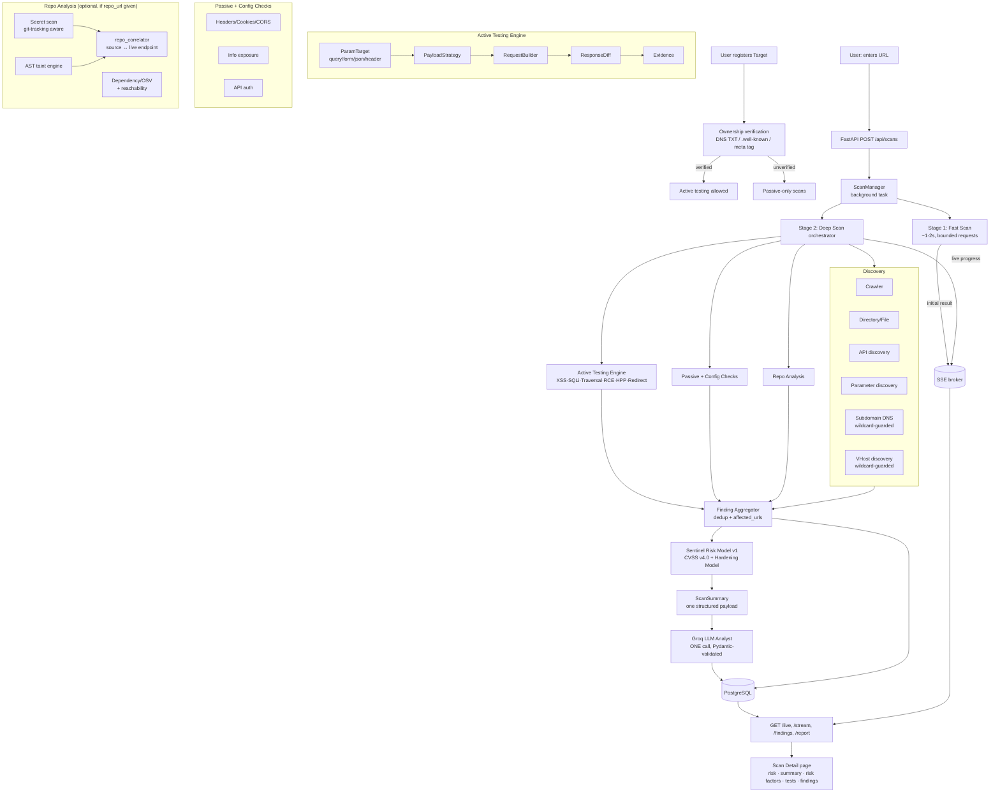

# Architecture

**Sentinel** — a web application security scanner with two entry points:

1. **Web pipeline** — a user registers a target, verifies ownership, and
   enters a URL. A fast preliminary result comes back in ~1-2s, then a deep
   automated assessment runs in the background and is analyzed by an LLM.
   Two-stage async pipeline: **Fast Scan** → **Deep Scan** → **one Groq
   call** → results on a single page, streamed live over SSE.
2. **CLI / CI-CD pipeline** (`app/cli.py`) — a static, local, non-network
   scan of a source checkout: secrets, AST-based SAST, and dependency
   advisories, scored by the same deterministic **Sentinel Risk Model** and
   gated on severity/risk thresholds for build pipelines. No target
   ownership verification applies here — the developer already has the
   checkout. See [CLI / CI-CD Mode](#cli--cicd-mode).

Both entry points funnel findings through the same `FindingCandidate` →
`severity_policy.apply_policy` → `risk_model.calculate_sentinel_risk`
pipeline, so a CI run and a dashboard scan of the same code produce the same
number.

## High-level flow (web pipeline)



## Backend (FastAPI + async SQLAlchemy + Postgres)

```
app/
├── cli.py                CI/CD entrypoint: `python -m app.cli scan <path>`
│                         (see CLI / CI-CD Mode below) — no FastAPI needed
├── api/
│   ├── auth.py           signup/login (JWT), /auth/me
│   ├── targets.py        register a target, issue/verify ownership challenge
│   ├── scans.py          REST + SSE: create, /live, /stream, findings,
│   │                     endpoints, subdomains, source-findings,
│   │                     repositories, events, report, cancel
│   └── dashboard.py      summary stats (scoped to the caller)
├── services/
│   ├── scan_manager.py   owns lifecycle; launches background task; persists;
│   │                     publishes progress to the SSE broker
│   ├── scan_broker.py    in-process pub/sub (asyncio queues) for SSE
│   ├── target_verification.py  DNS TXT / .well-known file / meta-tag
│   │                     ownership challenges; gates active testing
│   ├── http_client.py    Fetcher: pooled AsyncClient, bounded concurrency,
│   │                     request budget, size caps, dedup, manual redirects,
│   │                     body (json/form) + header support, one bounded
│   │                     retry on transient network errors
│   ├── scope.py / scope_policy.py   URL validation + in-scope predicate
│   ├── fast_scanner.py   Stage 1: concurrent lightweight checks
│   ├── deep_scan.py      Stage 2 orchestrator (concurrent stages) +
│   │                     finding dedup + test-matrix builder + repo-analysis
│   │                     wiring (`_convert_repo_findings`, `correlate`)
│   ├── crawler.py        bounded BFS crawl; links/forms/params/uploads
│   ├── directory_scanner.py   wordlist dir/file + sensitive-file checks;
│   │                     redirects not followed for sensitive-file probes
│   ├── api_discovery.py  OpenAPI/Swagger + common API paths
│   ├── parameter_discovery.py normalized param dedup
│   ├── subdomain_scanner.py   DNS enumeration, guarded by the same
│   │                     wildcard-DNS check as vhost_scanner
│   ├── vhost_scanner.py  Host-header VHost discovery + isolation assessment;
│   │                     owns the shared `_wildcard_dns()` guard
│   ├── active_engine.py  UNIFIED active testing: ParamTarget → PayloadStrategy
│   │                     → RequestBuilder → ResponseDiff → Finding
│   │                     (XSS, SQLi, traversal, command-injection, HPP,
│   │                      open redirect; adaptive prioritization)
│   ├── security_checks.py     passive checks (headers, cookies, CORS,
│   │                     version, dir-listing, debug traces, sensitive files,
│   │                     API security); redirects not followed for API probes
│   ├── security_test_cases.py declarative test-case registry (extensible)
│   ├── response_analyzer.py   fingerprint + soft-404/SPA profiling +
│   │                     similarity + blocked-response (`INCONCLUSIVE`)
│   │                     detection for blanket-WAF/auth-gate responses
│   ├── repo_discovery.py      finds a public GitHub/GitLab repo for a target
│   ├── repo_analyzer.py       clones (blobless sparse clone) or reads a local
│   │                     checkout; secret scan (git-tracking aware — a
│   │                     gitignored/never-committed secret is reported
│   │                     informationally, not as a vulnerability), AST SAST,
│   │                     dependency/OSV scan with strict version-range
│   │                     validation and reachability
│   ├── repo_correlator.py     matches a source-code finding to a live
│   │                     endpoint by route-segment/filename token match;
│   │                     never invents confidence beyond the source
│   │                     finding's own, and dedups onto that finding's key
│   ├── sast_engine.py    AST-based taint analysis (source → sink, sanitizers)
│   ├── dependency_analysis.py  declared-dependency parsing, direct/dev/used
│   │                     classification
│   ├── reachability.py   is the advisory's named symbol actually reachable
│   │                     from attacker-controlled input?
│   ├── js_analyzer.py    bundled-JS route/secret extraction, live-probed
│   │                     before being treated as confirmed
│   ├── secret_redactor.py     redaction helpers shared by repo + summary paths
│   ├── version_ranges.py      semver range parsing/matching for advisories
│   ├── severity_policy.py     evidence-based severity/confidence
│   │                     normalization — a static pattern match on an
│   │                     attack-claim category (code_security,
│   │                     dependency_vulnerability, input_validation,
│   │                     authentication) is capped until demonstrated by
│   │                     an observed request/response pair
│   ├── risk_engine.py    deterministic scoring helpers (ordering only)
│   ├── risk_model/       Sentinel Risk Model v1 (see below)
│   ├── security_graph.py      attack-surface graph used by risk aggregation
│   ├── scan_summary.py   aggregates everything into ONE structured payload
│   ├── llm_security_analyst.py  Groq: one call, strict prompt, 1 retry,
│   │                     Pydantic SecurityAssessment (risk_score/level/
│   │                     summary/risk_factors/recommendation)
│   ├── report_generator.py    JSON report (+ frontend builds the PDF)
│   ├── finding_types.py  FindingCandidate + severity ranks
│   ├── discovery_types.py     crawl/discovery dataclasses
│   └── wordlists.py      small embedded wordlists
├── models/               SQLAlchemy: User, Target, VerifiedTarget, AuditLog,
│                         Scan, ScanEvent, DiscoveredEndpoint, Parameter,
│                         Subdomain, Finding, Report, Repository,
│                         SourceFinding — see README's Database Schema
├── config.py             env-driven settings (DB, JWT, Groq, repo-clone,
│                         per-stage safety limits)
└── database.py           async engine/session
alembic/                  migrations (12, linear — see README)
```

## CLI / CI-CD Mode

`backend/app/cli.py` runs the same `repo_analyzer` secret/SAST/dependency
scan and the same `severity_policy` + `risk_model` pipeline as the web
dashboard's repo-analysis path, against a local checkout — no network target,
no ownership verification:

```bash
cd backend
PYTHONPATH=. python3 -m app.cli scan <path> \
    --fail-on {info,low,medium,high,critical} \
    --max-risk <int> \
    --json report.json \
    [--skip-deps] [--quiet]
```

Two independent gates decide the process exit code (`0` = all configured
gates passed, `1` = a gate failed, `2` = usage/error):

- **Severity Gate** — did any finding meet/exceed `--fail-on`?
- **Risk Gate** — did the overall risk score exceed `--max-risk`?

A low overall score never overrides a failed severity gate and vice versa —
each is evaluated and reported independently, with the specific finding(s)
or score that caused a failure named in the output. `--json` writes a
machine-readable report (`risk_score`, `risk_level`, `gates`, `exit_code`,
per-finding detail) suitable for GitHub Actions, GitLab CI, or any CI runner.

A **gitignored, never-committed secret** (e.g. a local `.env`) is reported
as an informational "Secret Hygiene" note — `Status: IGNORED / NOT EXPOSED`
— and contributes zero to the risk score, since it was never actually
exposed to anyone who clones the repository. A genuinely **committed**
secret is unaffected and still scores as a Critical vulnerability.

## Sentinel Risk Model v1 (`app/services/risk_model/`)

Deterministic, auditable, pure — the same findings always produce the same
score; no LLM involvement in scoring itself (the LLM only explains the
finished number). Two scales, never mixed:

- **CVSS v4.0** for actual vulnerabilities (SQLi, XSS, traversal, hardcoded
  secrets, ...), scored via the `cvss` library against the vulnerability
  class's fixed vector — not approximated or adjusted.
- **The Sentinel Hardening Model** for configuration weaknesses (missing
  headers, weak cookies, present-but-unreachable dependency advisories) on
  its own documented 0–100 scale — an absent mitigation, not an
  independently exploitable flaw.

Detection **confidence** (`confirmed` / `potential` / `uncertain` /
`false_positive` → 0.95 / 0.60 / 0.35 / 0.0; any unrecognized value is
treated as `uncertain` and logged, never silently defaulted to a mid-value)
and **detection status** (`DETECTED` / `VALIDATED` / `EXPLOIT_DEMONSTRATED`)
scale a finding's contribution but never change its severity band. Findings
are **deduplicated by `dedup_key`** before scoring — the same underlying
issue reported by two engines (e.g. a SAST hit and `repo_correlator`'s live
correlation of it) must share a key so it scores once, not twice. A single
severe finding sets the floor; everything else adds only a bounded,
diminishing remainder of the distance to 100, so breadth registers without
letting many weak/uncertain findings outweigh one confirmed Critical.

**Risk authority (web pipeline only):** the deterministic scanner produces
*evidence*; the risk score/level shown on the dashboard come solely from
Groq's validated assessment (if Groq is unavailable the UI shows "AI
analysis unavailable" with no fabricated score). The CLI has no LLM step —
its score is the raw Sentinel Risk Model output, which is what CI gates
against.

## Auth & Target Verification

Accounts (`User`) have a **role** that decides which half of the product
they see: `developer` runs full authorized scans against their own
infrastructure; `customer` only gets a passive URL safety check. JWT auth
(`app/services/auth.py`, 7-day expiry by default); the frontend never holds
long-lived credentials.

Before **active testing** (crafted/attacking payloads) may run against a
`Target`, the caller must complete one ownership-verification challenge
(`app/services/target_verification.py`), issued by `POST /api/targets` and
checked by `POST /api/targets/{id}/verify`:

- **DNS** — a TXT record at `_sentinel.<hostname>` containing the issued token.
- **HTTP file** — `/.well-known/sentinel-verification.txt` on the host.
- **Meta tag** — `<meta name="sentinel-verification" content="...">` in `<head>`.

Verification is TTL-limited (90 days) and tracked as
`UNVERIFIED → VERIFICATION_PENDING → VERIFIED` (or `VERIFICATION_FAILED` /
`EXPIRED`). Until `VERIFIED`, scans against that host run **passive-only**
— no crafted payloads sent. `localhost`/loopback/private-IP targets are
exempt (there's no one else to ask permission from). Security-sensitive
actions are appended to `AuditLog`; verification tokens and scan payloads
are deliberately never written there.

## Recent robustness hardening

An audit of the scanning pipeline found several places where a single weak
signal could produce a false positive/negative or a miscalibrated severity.
Fixed, all as corrections to existing logic rather than new architecture:

- **Secret git-tracking awareness** — a secret in a file that is gitignored
  and never staged is reported as an informational hygiene note (zero risk
  contribution), not scored the same as a genuinely committed exposure.
- **Severity capping scoped correctly** — an unconfirmed finding (no
  observed request/response pair) is capped at Medium, but only for
  categories that make an *attack* claim (`code_security`,
  `dependency_vulnerability`, `input_validation`, `authentication`) — a
  secret match is its own evidence and is exempt, so a confirmed committed
  secret still scores Critical.
- **`repo_correlator` no longer manufactures confidence** — a route-segment
  match to a filename is one corroborating signal, not a demonstration; it
  now requires an exact token match (not a bare substring) and propagates
  the source finding's own confidence instead of hardcoding `confirmed`,
  and reuses that finding's `dedup_key` so it merges instead of scoring the
  same issue twice.
- **Blocked/WAF responses** — `response_analyzer` compares a 401/403
  against a captured baseline probe and returns `INCONCLUSIVE` (not
  `REAL`) when the block is a generic, blanket response, so a WAF or
  catch-all auth gate can't flood discovery with false hits.
- **Wildcard-DNS guard shared between `vhost_scanner` and
  `subdomain_scanner`** — a wildcard record makes every probed
  label/subdomain "resolve," carrying no information.
- **Redirects not silently followed** in sensitive-file/API discovery
  probes, so a 3xx to a login/error page is never misattributed to the
  originally probed path.
- **`http_client` bounded retry** — one retry on transient
  connect/timeout/refused errors before giving up, so a single dropped
  packet isn't read as "this path is safe."
- **`confidence_of` no longer defaults unknown values to a mid-score** — an
  unrecognized confidence string is treated as `uncertain` (the lowest
  non-zero tier) and logged, never silently scored between `uncertain` and
  `potential`.
- **Dependency-scan correctness** — malformed manifests log a warning
  instead of failing silently; a package pinned to different versions in
  `dependencies` vs `devDependencies` is queried for both instead of one
  being dropped by a dict-merge collision.

Regression tests for all of the above live in `backend/tests/`.

## Frontend (React + TypeScript + Vite + Tailwind)

```
src/
├── App.tsx               routes: Dashboard, New Scan, Scan Detail
├── components/Layout.tsx top bar / nav
├── pages/
│   ├── NewScan.tsx       single URL input → POST /api/scans
│   ├── Dashboard.tsx     recent scans + Groq risk + severity chart
│   └── ScanDetail.tsx    live SSE view: risk hero, AI summary, risk factors,
│                         security-test matrix, findings, PDF export
├── services/api.ts       REST client + EventSource (SSE) stream
└── types/index.ts        shared types
```

The Groq API key lives only on the backend and is never sent to the frontend.

## Scan lifecycle

```
QUEUED → FAST_SCANNING → INITIAL_RESULT_READY → DEEP_SCANNING
       → AI_ANALYSIS → COMPLETED          (or FAILED / CANCELLED)
```

## Test target

`testsite/server.py` — a loopback-only, deliberately vulnerable app (fake
secrets) used for development and the integration tests. See `TESTING.md`.

## Performance principles

Optimise **time-to-first-result** (Fast Scan), then run the Deep Scan in the
background. Everywhere: `asyncio` + pooled `httpx.AsyncClient`, bounded
concurrency, per-scan request budget, response-size caps, request dedup, short
timeouts, and **baseline → high-value test → variants only if interesting**
(no brute-forcing every payload against every parameter). One Groq call per
scan — never per finding or per request.
```
