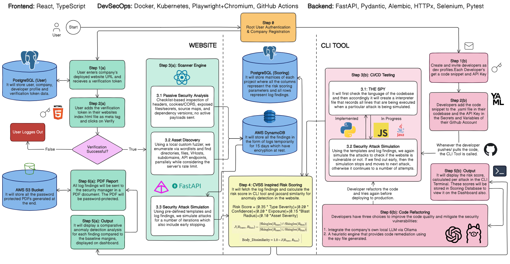

# Perry — Web Application Security Scanner

Perry scans web apps for real vulnerabilities and scores the risk — automatically, with evidence for every finding.

> ⚠️ For authorized security testing only: your own apps, apps you have written permission to test, or intentionally vulnerable training apps.

## What it does

- **Scans a live URL** — discovers pages, APIs, and forms (including JS-rendered SPAs) and tests them against **12 real attack types**: SQL Injection, XSS, Path Traversal, Open Redirect, Security Misconfiguration, Info Disclosure, Auth/Authz, API Auth, HTTP Parameter Pollution, File Upload, VHost Isolation, Subdomain Takeover.
- **Scans source code** via a standalone CLI — SAST, secret detection, and dependency vulnerabilities across 8 languages, built for CI/CD pipelines.
- **Scores every finding deterministically** — no AI guessing. A 5-factor formula (severity, confidence, exposure, blast radius, asset severity) produces a risk score backed by evidence, plus a separate coverage/confidence metric.
- **Streams results live** as the scan runs, with a full report and dashboard at the end.

## Architecture



- **Frontend**: React, TypeScript
- **Backend**: FastAPI, Pydantic, Alembic, HTTPx, Selenium, Pytest
- **DevSecOps**: Docker, Kubernetes, Playwright + Chromium, GitHub Actions

See [ARCHITECTURE.md](./ARCHITECTURE.md) for the full pipeline design and risk model.

## Quick start

**Requirements**: Python 3.12+, Node.js 20+, PostgreSQL 14+

```bash
# 1. Database
createdb web_fuzzer

# 2. Backend
cd backend
python3.12 -m venv .venv && source .venv/bin/activate
pip install -r requirements.txt
playwright install chromium   # optional, enables JS/SPA crawling
alembic upgrade head
uvicorn app.main:app --reload   # http://localhost:8000

# 3. Frontend
cd frontend
npm install
npm run dev   # http://localhost:5173
```

Copy `.env.example` to `.env` first and set `DATABASE_URL` / `JWT_SECRET`.

### CI/CD source scan (no database needed)

```bash
cd backend
python -m app.cli scan /path/to/repo --fail-on high --json report.json
```

## Docs

- [ARCHITECTURE.md](./ARCHITECTURE.md) — full pipeline, risk scoring, database schema
- [deploy/aws/README.md](./deploy/aws/README.md) — single-box AWS deploy with Docker Compose
- [render.yaml](./render.yaml) — Render + Vercel deploy blueprint
